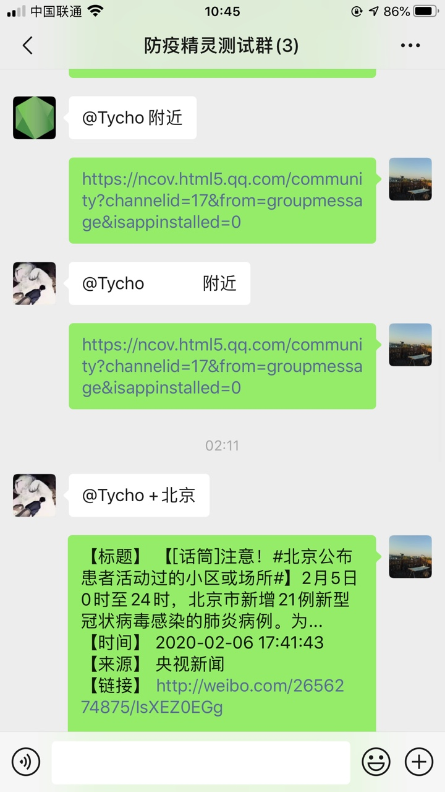
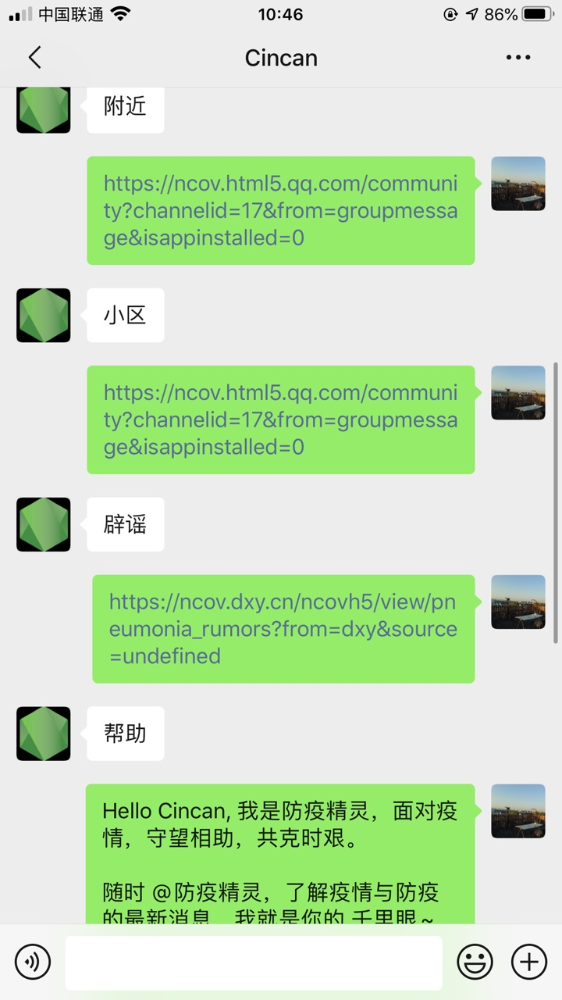

## 防疫精灵

一个运行于 wechat 的机器人, 基于 Node.js。
可以查询肺炎现况、确诊小区、专家问询、城市感染人数查询等功能。


## 快速开始

1. 克隆和启动项目:
   
```bash

$ git clone git@github.com:sheencity/victory-bot.git

$ npm install

$ npm run start
```

2. 扫描控制台二维码登录微信账号, 一个在线机器人已经开始运行。


## 回复机制
目前，Immunity Spirit 有两套回复的策略：
1. 在群聊中，只要 @Immunity Spirit ，机器人就会主动回复
   
**群聊**：

<br><br><br>


2. 在私聊中，必须键入关键词，才能触发回复内容
   
**私聊**


*私聊关键词包括 `const keywords = ['帮助', '辟谣', '门诊', '预防', '实况', '专家', '症状', '疫情', '冠状', '肺炎'];`*


## Q & A

1. 【登录限制】为何我的微信无法扫码登录？
从 2017 年 6 月下旬开始，使用基于 web 版微信接入方案存在大概率的被限制登陆的可能性。 
主要表现为：无法登陆 Web 微信，但不影响手机等其他平台。 验证是否被限制登陆： [https://wx.qq.com](https://wx.qq.com) 上扫码查看是否能登录。

2. 【频率限制】为什么会偶尔掉线？


当机器人回复消息过于快速/积极，且有迹可循时，容易引发自动**登出**的问题，所以建议 @ImmunityBot 的频率不要过高，或者私聊时发送消息的频率不要太频繁。


## 贡献者

[Cincan](https://github.com/Cincan)
[ZQ-jhon](https://github.com/ZQ-jhon)
陈宏伟

## 感谢

[wechaty](https://github.com/wechaty/wechaty)
[dragon-yuan](https://github.com/dragon-yuan/2019-nCoV-news)