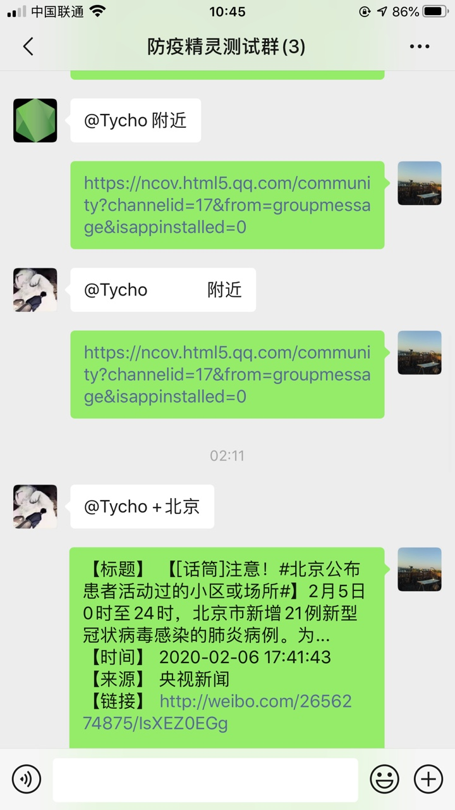
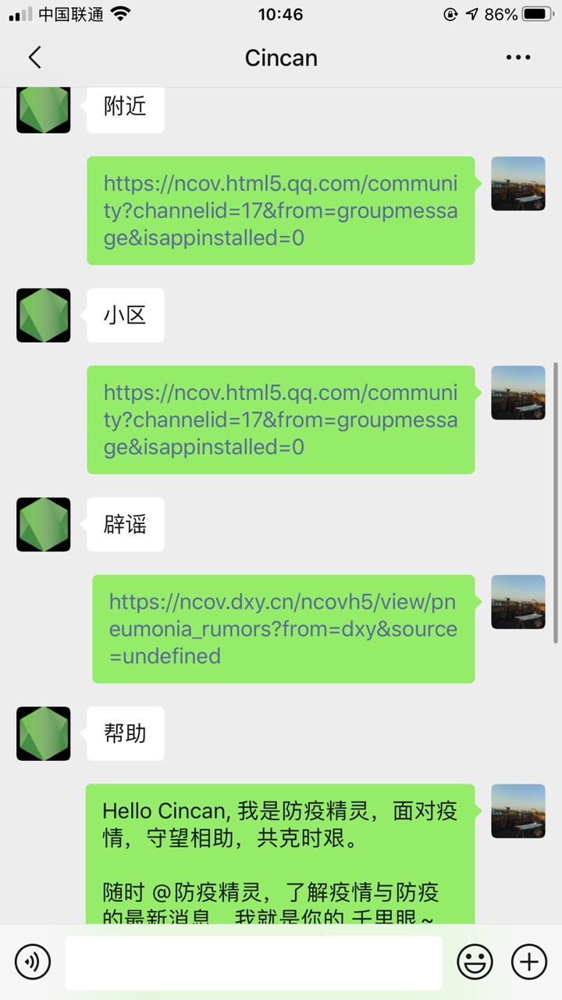
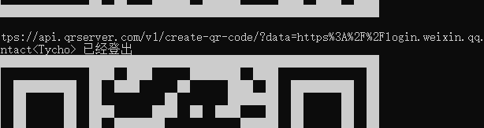

[中文版](./README-cn.md)

## Immunity Spirit

A online bot running at wechat, based on Node.js.

It can query the current situation of pneumonia, the confirmed community, the experts and the number of people infected in the city.


## Quick Start

1. clone & start this repo:
```bash

$ git clone git@github.com:sheencity/victory-bot.git

$ npm install

$ npm run start
```

2. Scan the QR code of the console for login wechat account, then an online bot has running.

enjoy it!


## Reply Strategy

In fact, immunity spirit has two response strategies:


1. In room chat, must @ImmunitySpirit to reply. 
   
**Room chat**：

<br><br><br>


2. In private chat, you must enter the following keywords to trigger a reply:

**Privite chat**


*keywords includes `const keywords = ['帮助', '辟谣', '门诊', '预防', '实况', '专家', '症状', '疫情', '冠状', '肺炎'];`*


## Q & A

1. [Login Restriction] why can't I scan my wechat code to login?

Since the end of June 2017, there is a possibility of restricted login using the wechat access scheme based on Web version.
The main performance is: unable to log in to the web wechat, but does not affect other platforms such as mobile phones. Verify if login is restricted: [https://wx.qq.com](https://wx.qq.com) scan the code to see if login is possible.

2. [Frequency Limit] Why is it occasionally dropped?



When the robot replies to the message too quickly / actively and has traces to follow, it is easy to cause the problem of automatic **logout**, so it is suggested that @ImmunityBot should not be too frequent, or the frequency of sending messages in private chat should not be too frequent.

## Thanks

[wechaty](https://github.com/wechaty/wechaty)
[dragon-yuan](https://github.com/dragon-yuan/2019-nCoV-news)